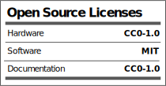

# N32B - Midi Controller
N32B Midi controller is an open source hardware and software.
We use the arduino pro micro as the heart of the controller. The N32B is basically an arduino shield and easy to solder project.

You can contribute, build your own or buy a full working device.

You will find the schematics and board layout files in this repository.
Feel free to fork, we would love to see what you created!

# Firmware Repositories
A separate repositories are available for the device firmware variations:

Midi CC firmware:
https://github.com/Shik-Tech/N32B_HiRes

SysEx firmware:
https://github.com/Shik-Tech/N32B-sysEx

## Licensing

Hardware and documentation license is under CC0 1.0 Universal.

Firemware license is under MIT License.

You can find more details about licensing here: https://github.com/Shik-Tech/N32B/blob/master/LICENSE.md

## Additional Information
For more information please visit https://shik.tech
